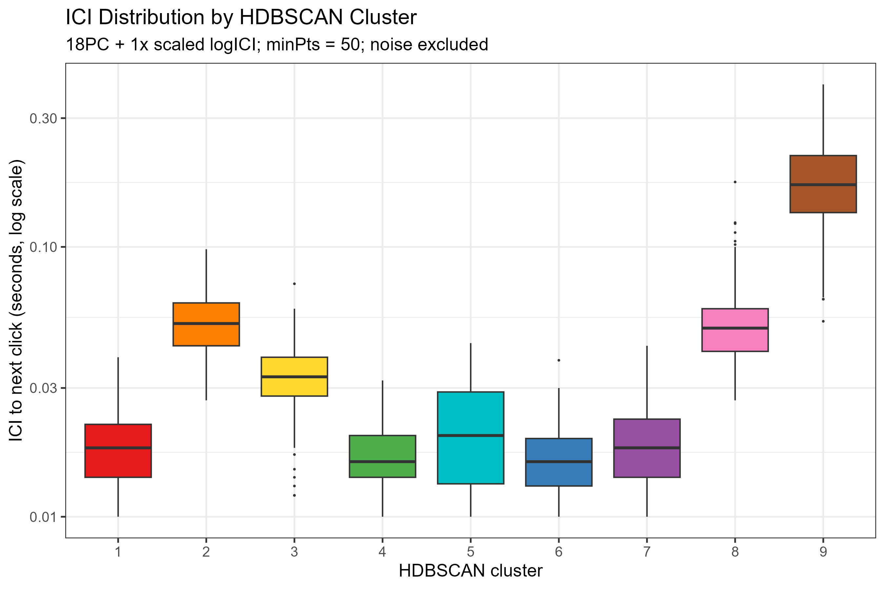
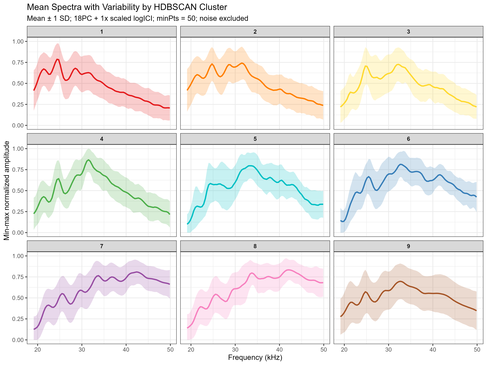

## **Authors**

Sarah M.S. Moseley

San Francisco State University's Estuary and Ocean Science Center

### For Manuscript

Sarah M.S. Moseley^1^, Marie A. Roch^2^, Shannon Rankin^3^, Cory Hom-Weaver^4^, Ellen Hines^1^, Anne Simonis^1^

\*Add Jeff and Jay

^1^ San Francisco State University's Estuary and Ocean Science Center

^2^ San Diego State University

^3^ NOAA SWFSC

^4^ Ocean Science Analytics

# Acknowledgements

Committee, Co-authors, EOS Center, Simonis-Hines-Jahncke Lab, BOEM and NOAA for data collection, CSU COAST, ONR for graduate student support, Melissa Soldevilla, Soldevilla et al. 2017, Sara Keen

# I. Introduction

Risso's dolphins (*Grampus griseus*) are globally distributed, deep-diving odontocetes primarily found in temperate and tropical environments, where they are commonly associated with continental slope and offshore habitats [@baird2009]. Despite their broad distribution, Risso's ecology and population structure remain relatively unstudied [@jefferson2017]. As with many pelagic cetaceans, studying Risso's dolphins presents challenges as animals occupy large and dynamic habitats, are difficult to observe consistently over time and space, and may exhibit biological structuring that is not readily apparent from visual surveys alone [@forney1998; @smith2020]. As a result, uncertainty introduced by these challenges complicates efforts to define biological population boundaries, yet such boundaries are pivotal to effective species management and conservation [@carretta2024; @grech2011].

Along the United States West Coast within the United States Exclusive Economic Zone (US EEZ), Risso's dolphins are managed within one, broad "stock" delineation defined for assessment and conservation purposes – the California-Oregon-Washington (CA-OR-WA) stock [@carretta2024]. The offshore extent of this stock's boundaries are unknown, and the currently recognized management unit may overlook multiple independent populations [@carretta2024]. For this reason, any independent line of evidence that helps to evaluate spatial and temporal structuring within this broadly managed system is scientifically and practically valuable [@martien2019].

This exploration is especially relevant in the California Current Ecosystem (CCE) – a large, eastern boundary current characterized by strong gradients in bathymetry, productivity, oceanography, species diversity, anthropogenic impact, and prey availability [@mcclatchie2025]. Such heterogeneity lends itself to shaping cetacean distribution, use of habitat, and foraging behavior across space and time [@barlow2007]. As an offshore species associated with deep-water habitats, for Risso's dolphins the CCE provides a biologically meaningful setting in which to explore temporal and geographic variation in the acoustic characteristics of the species within a single, dynamic ecosystem [@barlow2007; @forney1998].

Passive Acoustic monitoring (PAM) is particularly well suited to address these questions as odontocetes rely heavily on sound for prey detection, navigation, and social interaction, and acoustic methods can identify and record animals in locations and conditions where visuals methods are unable to [@mellinger2003]. In this study, drifting passive acoustic monitoring was utilized to survey acoustic activity throughout the CCE. Drifting PAM is especially valuable because it provides an effective balance between the geographic resolution of towed systems and the temporal resolution of fixed seafloor recorders. With relatively low cost and flexible deployment, broader spatial coverage is achieved, making it especially well suited for surveying mobile and elusive species directly within the water column [@rankin2025]. In a system such as the CCE, drifting PAM allows fine-scale characterization of acoustic patterns that would otherwise be challenging to capture [@rankin2025; @simonis2020].

Risso's dolphin echolocation clicks serve as valuable markers for this kind of analysis as they exhibit distinct spectral banding – specifically recurring peaks and notches in the shape of the spectra [@soldevilla2008]. These spectral features are hypothesized to reflect the impacts of morphological structures within the sound production and propagation process, and are stable enough to allow for species identification [@cranford1996; @mckenna2012; @soldevilla2008; @soldevilla2010]. More importantly for this study, spectral banding in the echolocation clicks of Risso's dolphins provides a measurable framework for comparison of click structure across encounters, regions, and time [@soldevilla2017]. If spectral characteristics vary systematically, such variation could indicate morphological, behavioral, ecological, or population differences [@soldevilla2008; @soldevilla2017].

Beyond direct comparison of peak and notch frequencies, advances in unsupervised learning approaches provide an opportunity to examine variation at the echolocation click spectral-level. Dimensionality reduction and clustering techniques have been increasingly applied in bioacoustics to identify recurring signal types, characterize vocal repertoires, and explore structure within large spatial and temporal scale acoustic datasets [@best2023]. In particular, dimensionality reduction approaches such as Uniform Manifold Approximation and Projection (UMAP) can be used to summarize highly complex, high-dimensional acoustic features and preserve biologically meaningful relationships among signals, while density-based clustering methods, such as Hierarchical Density-Based Spatial Clustering of Applications with Noise (HDBSCAN), provide a way to identify recurring signal types without requiring manual cluster number specification [@alexander2025; @best2023; @mcinnes2017; @mcinnes2020]. Together, these approaches provide a solid framework for investigation into spectral-temporal variation among echolocation clicks and identifying recurring click types within large PAM datasets.

Previous studies by @soldevilla2008 and @soldevilla2017 have shown Risso's echolocation clicks to consistently possess spectral banding structure across regions, with banding structure and associated frequency shifts suggesting geographic variation. This foundational work established an important baseline for species identification and raised the question as to the possible biological meaning behind click variation. However, while @soldevilla2008 and @soldevilla2017 characterize spectral characteristics and variation of Risso's clicks in regions such as the U.S. East Coast, Gulf of Mexico, Hawaiian Islands, and the California Current's Southern California Bight, the CCE has not be studied as its own ecosystem-scale case [@rankin2025]. What remains unclear is how spectral structure varies within the CCE itself as an environmentally heterogeneous and ecologically important region [@mcclatchie2025; @soldevilla2017]

Addressing this knowledge gap is relevant for both management and ecology. Characterization of Risso's dolphin click spectra across the CCE can improve interpretation of PAM detection, assist in refining regional habitat use understanding, and provide additional context relevant to biological structuring within a broadly managed offshore environment [@barlow2007; @carretta2024; @forney1998; @soldevilla2017]. It also places the CCE in the broader bio-geographic context of pre-existing population variation patterns while establishing the baseline needed to interpret acoustic trends within the ecosystem [@soldevilla2010; @soldevilla2017]. In an era of increasing offshore anthropogenic impact, stronger foundational understanding is both scientifically and practically important across the CCE [@andrews2015; @carretta2024; @vanparijs2023].

This study examines the echolocation clicks of Risso's dolphins within the CCE and serves as the first comprehensive assessment of Risso’s dolphin click characteristics across the CCE – enabling comparison with other US regions where click type divergence has been observed. First, click events were screened for quality through manual inspection to exclude background noise and non-target signals, and spectra were smoothed to enhance consistent banding structure. Next, a spectral-temporal clustering framework incorporating principal component analysis (PCA), UMAP, and HDBSCAN was used to identify recurring click types across encounters. Finally, the geographic distribution and spectral characteristics of identified click types were evaluated throughout the CCE and compared with patterns previously described by @soldevilla2017.

# II. Materials and Methods

## A. Data Collection

The acoustic data used in this study were collected as part of three off-shore acoustic surveys conducted by National Oceanographic and Atmospheric Administration Southwest Fisheries Science Center (NOAA SWFSC) and the Bureau of Ocean Energy Management (BOEM). For this study, field data collection was not involved; instead, it makes use of the collected PAM datasets generated during these coordinated inter-agency efforts.

The three surveys included in this study were the Passive Acoustic Survey of Cetacean Abundance Levels (PASCAL, 2016; Keating et al. 2018), the California Current Ecosystem Survey (CCES, 2018; Simonis et al. 2020), and Adrift in the California Current (Adrift, 2020-2023; Rankin et al. 2025). Together these surveys allow for broad-scale spatial and temporal coverage of the CCE, spanning from the south tip of the Baja California Peninsula to the Washington/Canadian border and the United States West Coast. Additionally, this dataset accounts for focal regions associated with proposed off-shore wind energy development along the U.S. West Coast; Morro Bay, off-shore San Francisco, and Humboldt Bay in California, and Brookings and Coos Bay in Oregon [@rankin2025].

The acoustic recordings used from these surveys were collected using drifting passive acoustic recorders made up of a buoy and satellite GPS at the surface, with a vertically suspended hydrophone array and autonomous recorder positioned at depth. The devices were designed to flow freely with currents while continuously keeping the recording instruments deep enough to reduce surface noise contamination.

The hydrophone array was suspended approximately at 100 meters depth and was composed of two hydrophones spaced approximately 5 meters apart allowing for signal localization via time difference of arrival [@gillespie2019]. The SoundTraps (Ocean Instruments, NZ) were programmed to record acoustic data at a minimum sampling rate of 288 kHz, with continuous recording schedules on Adrift and 2 minute duty cycles on PASCAL and CCES. To ensure comparability across deployments, this study is restricted to recordings collected using SoundTrap recorders (models ST4300 and ST640) equipped with a HTI-92WB hydrophone. This works to minimize variability in factors that could otherwise negate comparisons of acoustic detections.

The drifting acoustic recorders were tracked via the GPS surface buoys, allowing for the reconstruction, visualization, and analysis of the drift trajectories and spatial context. Recorders were deployed as individual drifts or as part of a cluster, dependent upon survey design, with the clustered deployments facilitating better spatial understanding of acoustic detections.

Due to the off-shore nature of the acoustic surveys, environmental conditions, such as strong currents and surface motion, sometimes introduced self-noise (e.g. strumming of the array), and was considered during later data quality assessment and pre-processing by NOAA analysts.

Comprehensive descriptions of survey objectives, deployment methodologies, instrumentation specifications, quality assurance procedures, and broader data processing workflows are provided in the corresponding PASCAL, CCES, and Adrift survey reports [@keating2018; @rankin2025; @simonis2020].

## B. Acoustic Event Processing

Acoustic recordings from the PASCAL, CCES, and Adrift surveys were initially pre-processed by NOAA analysts [@rankin2025]. Analysts used Matlab-based Triton software [@frasier2024] to identify the start and end times of acoustic events of Risso's dolphin echolocation clicks using long-term spectral averages (LTSA) viewed in one hour increments with a five second, 200 Hz resolution. From these analyst-labelled events, broadband echolocation clicks were identified using a customized detection workflow within the PAMguard software [version 2.02.15; @gillespie2008]. Click detection utilized a 15 dB signal-to-noise (SNR) threshold. Echolocation clicks were grouped into categories dependent upon click peak frequency, with each category identified by a symbol and shape, paralleling the systems used by @simonis2020 and @keating2018. The categories for peak frequencies of clicks were 2-15, 15-30, 30-50, and 50-80 kHz.

Analyst-identfied Risso's dolphin event times were imported into R and used to group PAMGuard detections into event-level acoustic study objects. Click features were calculated via the PAMpal package in R [@sakai2026] using a 2.5 ms analysis window and 10-80 kHz bandpass filter. During this processing step, a suite of standard features were calculated from the PAMGuuard click detections, including unique click identifiers, timing information, amplitude, spectral measurements, and inter-click interval [@sakai2026]. Additionally, in R clicks were omitted from events if they were assigned to classifiers 0 or 1 – making them unclassified or having a peak frequency between 2-15 kHz – or if they had measure peak frequencies below 15 kHz or duration great than 2000 ms which are features that would suggest that these detections were false positives.

The goal of this study was to evaluate variation in spectral banding in clicks, so clicks without spectral banding were omitted from the analysis. Each candidate Risso’s dolphin event was manually reviewed through comparison of concatenated spectrograms, mean spectra, and broader event context. Events were retained only when they displayed the expected spectral banding structure of Risso’s dolphin echolocation clicks, contained more than 100 echolocation clicks to ensure sufficient representation of spectral structure, and did not overlap with recorded detections of other cetacean species [@soldevilla2017]. Events occurring within 20 minutes before or after a non-target species detection, such as Pacific white-sided dolphin (*Aethalodelphis obliquidens*), were excluded and classified as potential multi-species encounters to reduce the likelihood of acoustic contamination.

For all retained events, concatenated spectrograms and mean spectra were visually inspected to identify individual clicks lacking the characteristic Risso’s dolphin spectral banding structure. Detections were removed when inconsistent with known Risso's dolphin click characteristics or likely to represent non-biological or non-meaningful acoustic signals [@soldevilla2017]. This iterative review process was used to improve consistency of the final echolocation click dataset prior to downstream analyses.

To reduce small-scale spectral fluctuations while preserving the broader peak and notch structure of echolocation clicks, click spectra from the cleaned dataset were smoothed using a five-point Tukey smoothing approach [@rabiner1975]. Tukey smoothing was applied before clustering to improve the stability and consistency of spectral banding patterns across clicks and events.

Cepstral liftering approaches were also explored as a potential method for reducing broad spectral effects related to recording system response, and overall spectral tilt while preserving the finer-scale peak and notch structure of Risso’s dolphin echolocation clicks (Soldevilla et al. 2008, 2017). In cepstral analysis, the log-magnitude spectrum is transformed into the cepstral domain, where low cepstral coefficients, or quefrencies, describe slowly varying spectral structure, while higher quefrencies retain finer-scale spectral features \[ @picone1993; @rabiner1993\]. Previous Risso’s dolphin studies used high-pass liftering after truncating spectra to 19–50 kHz to de-emphasize broad spectral-envelope effects while retaining the main peak and notch features used to describe spectral banding (Soldevilla et al. 2008, 2017). In the present study, liftering was tested on the click spectra but the dominant peak and notch positions remained largely unchanged. Therefore, all subsequent analyses were conducted using only the Tukey-smoothed spectra.

## C. Cluster Analysis

### *1. Spectral-Temporal Pre-processing*

Prior to clustering analyses, echolocation click spectra were standardized to ensure comparability across events and surveys. Although all processed spectra contained 512 frequency bins, recordings were represented on two different frequency grids, with bin spacings of approximately 375 Hz or 281.25 Hz. To ensure that corresponding bins represented the same frequencies across the dataset, spectra were linearly interpolated to a shared reference frequency grid with approximately 375 Hz spacing. Following interpolation, the spectra were restricted to a range of 19–50 kHz, following methods of @soldevilla2017. This frequency range encompasses the primary banding structure of Risso’s dolphin echolocation clicks, while removing lower- and higher-frequency components not relevant to the present analysis. Spectra were then min-max normalized across the retained frequency range so that clustering emphasized relative spectral shape rather than absolute received level [@patro2015]. To incorporate temporal information while reducing the influence of non-representative click sequences, ICI measurements were joined to the spectral dataset, and clicks with ICI values below 0.01 s or above 0.4 s were removed [@madsen2004]. Finally, to minimize unequal representation among encounters, a maximum of 200 clicks were randomly sampled without replacement per event following ICI filtering [@soldevilla2017]. Events containing fewer clicks than the 200 click threshold retained all clicks. The resulting dataset was used for all subsequent dimensionality reduction and clustering analyses.

### *2. Dimensionality Reduction*

To identify recurring click types, a clustering workflow integrating both spectral shape and ICI information was developed. Preliminary clustering approaches, including k-means clustering, k-shape clustering, and density-based full-spectra clustering, were evaluated during early stages of workflow development [@mcinnes2017; @paparrizos2015]. While these approaches identified broad patterns of spectral-temporal variation, they did not adequately resolve discrete click groups. Instead, variation appeared largely continuous across clicks rather than organized into a small number of clearly separated clusters. Consequently, a dimensionality reduction and density-based workflow was adopted to better characterize structure within the spectral-temporal feature space.

PCA was applied to the min-max normalized spectra to reduce dimensionality while preserving dominant patterns of spectral variation [@jolliffe2002] . Direct clustering of the full spectral dataset would require comparisons across dozens of highly correlated frequency bins, potentially taking away from boarder patterns of variation. In using PCA, a better representation of spectral shape was retained, along with a majority of the information contained within the original spectra. Because each spectrum had already been normalized during pre-processing, PCA was applied using centered, but unscaled, spectral values. Principal components (PC) accounting for 90% of the cumulative spectral variance of the dataset were preserved for the remainder of the clustering workflow.

To incorporate the temporal components of clicks to the clustering analyses, ICI were transformed using a log10 transformation and standardized to zero mean and unit variance. The standardized ICI values were combined with the retained PC to create a joint spectral-temporal feature space. Multiple ICI weights were evaluated throughout workflow development to determine the influence of temporal information on clustering outcomes. Ultimately, the final workflow maintained the fully weighted standardized ICI feature (1x) as it best preserved the contribution of click timing within the spectral-temporal framework.

UMAP was applied to the combined spectral-temporal feature space. While PCA reduced the dimensionality of the spectral data, the joint PCA and ICI feature space remained multidimensional and potentially contained a complex nonlinear structure. For this reason, UMAP was used to generate a two-dimensional embedding that worked to preserve local relationships while also providing a lower-dimensional representation of the dataset suitable for further visualization and density-based clustering [@best2023; @mcinnes2020]. UMAP was implemented using 30 nearest neighbors, a minimum distance of 0.1, Euclidean distance metrics, and a fixed random seed in order to ensure reproducibility. These parameters were selected in order to balance the broader organization of the spectral-temporal feature space with the preservation of local neighborhood, all while aiming to maintain usable density patterns.

### *2. Clustering*

HDBSCAN was applied to the resulting two-dimensional UMAP embedding [@alexander2025; @best2023]. HDBSCAN was selected as the clustering algorithm as it identifies clusters based upon local point density, does not require specification of the number of clusters, and allows for detections that do not belong to a well-defined cluster to remain unassigned [@best2023; @mcinnes2017] . Multiple point thresholds were explored during workflow development to assess clustering sensitivity and flexibility across a range of density requirements. A minimum point threshold of 50 was determined for the final analysis as it emphasized robust recurring density structure while also limiting fragmentation into small local clusters. The resulting cluster assignments were used for all following analyses of spectral-temporal and geographic variation.

## D. Cross-Regional Comparison

In order to evaluate whether Risso's dolphin echolocation clicks recorded within this CCE dataset exhibited spectral characteristics to those reported from other regions, spectral peak and notch frequencies were quantified and compared with values found by @soldevilla2017. For this event-level comparison, all retained events from the CCE dataset were treated collectively as a regional dataset, paralleling regional comparison framework by @soldevilla2017 rather than comparing individual click types.

For each retained event, an event-level mean spectrum was calculated from the sampled min-max normalized spectra. To identify spectral peaks and notches, the findpeaks function in the R package *pracma* was used for each event-level mean spectrum [@borchers2011]. Peak frequencies were identified as local maxima within the mean spectra, while notch frequencies were identified by inverting the spectra and applying the same procedure. Detected peak and notch frequencies were ordering by increasing frequency, with the first four peaks and first three notches retained for later analyses [@soldevilla2008; @soldevilla2017]. Peak detection was performed using a minimum peak height of 0.15, a minimum peak distance of one frequency bin, and a requirement of one ascending and one descending point surrounding each peak. These less restrictive settings were used to allow detection of closely spaced or less pronounced spectral extrema while retaining the same minimum amplitude threshold. Equivalent parameters were used during notch identification following spectral inversion.

Following all feature extraction, the frequencies of each peak and notch position were summarized across all retained CCE events by calculating the mean and standard deviation. These event-level summary statistics were then compared with published regional values reported by @soldevilla2017, including the Southeast U.S. Continental Shelf, Northeast U.S. Continental Shelf, Gulf of Mexico, Pelagic Pacific, and California Current's Southern California Bight.

## E. Click Type Comparison

In addition to the event-level regional comparison, spectral peaks and notches were quantified from the centroid spectra identified in the present study. This click type-level analysis was used to evaluate whether recurring click types identified in the CCE dataset showed spectral banding patterns similar to the nine Risso’s dolphin click types previously described by @soldevilla2017 across multiple geographic regions.

To support this click type-level comparison, MATLAB files associated with the @soldevilla2017 cluster spectra were imported and used to extract the mean spectra of the nine click types. The same peak and notch detection workflow and parameters described for the event-level analysis were then applied to both the @soldevilla2017 click type mean spectra and the present CCE click type mean spectra. The resulting peak and notch frequencies were then used to compare spectral banding patterns between the previously described click types and the click types identified in the present study.

# III. Results

Risso's dolphin echolocation clicks were detected across all three surveys - PASCAL, CCES, and Adrift - with the raw dataset containing 127 candidate acoustic events from 32 drifts. These included 28 events from PASCAL (22.0%), 49 events from CCES (38.6%), and 50 events from Adrift (39.4%). Following event-level review, 79 events were excluded from the dataset due to incompatible recorder type, insufficient number of click detections, recorder failure or data gaps, or multi-species detections. Only one candidate event was removed because it did not exhibit clear Risso's dolphin spectral banding. The retained dataset included 48 events from 20 drifts, composed of three PASCAL events (6.3%), 24 CCES events (50%), and 21 events from Adrift (43.8%). Following manual click-level cleaning, the retained dataset contained 344,153 clicks, with cleaned click counts ranging from 99 to 80,999 clicks per event. After filtering ICI from 0.01-0.4 s, 214,944 clicks were retained for downstream analysis **(retained dataset summary table)**.

**Instering retained dataset summary table**

## A. Spectral-Temporal Clustering and Resulting Click Types

9,220 clicks from 48 events were included in the spectral-temporal clustering workflow following ICI filtering and sampling of 200 clicks per event. The first 18 principal components accounted for 90.6% of the cumulative spectral variance of the dataset and were used in downstream analysis. These spectral features were combined with the fully weighted scaled log10 ICI feature and projected into a two-dimensional UMAP embedding. HDBSCAN cluster analysis of this UMAP embedding, using a minimum point threshold of 50, led to the identification of nine non-noise clusters which can be interpreted as recurring CCE click types (@fig-umap-click-types).

{#fig-umap-click-types width="90%" fig-align="center"}

Of the 9,220 sampled clicks, 4,501 clicks (48.8%) were assigned to the nine click types, while 4,719 (51.2%) were classified by HDBSCAN as low-density or unassigned. Click type 9 was the most prevalent assigned type with 2,745 clicks – 29.8% of all sampled clicks and 61.0% of assigned clicks. The remaining click types were smaller, ranging from 66 clicks in click type 5, to 510 clicks in click type 7. This clustering result indicates that click type 9, the most dominant click type, was prevalent across the sampled dataset, while lower-abundance click types represented smaller, but still meaningful, distinct regions of the spectral-temporal feature space.

{#fig-click-type-ici width="80%" fig-align="center"}

The identified click types differed in click timing, as well as spectral structure (@fig-click-type-ici). Median ICI values separated the click types into broadly defined temporal groups; click types 1, 4, 5, 6, and 7 characterized by short median ICIs of approximately 0.016-0.020 s, click types 2, 3, and 8 characterized by intermediate median ICIs of approximately 0.033-0.052 s, and click type 9 characterized by a substantially longer median ICI of 0.170 s.

{#fig-click-type-spectra width="100%" fig-align="center"}

**Inserting concatenated spectrograms of the nine CCE clusters**

The mean spectra for the nine click types all exhibited the characteristic peak and notch structure of Risso's dolphin echolocation clicks, but differed in the frequency placement and spacing of these features (@fig-click-type-spectra) **(concatenated spectrogram figure)**. Across the identified click types, the first peak ranged from 21.4-22.9 kHz, the second peak ranged from 24.4-25.5 kHz, the third peak ranged from 25.5-33.8 kHz, and the fourth peak ranged from 26.6-37.5 kHz. Notch frequencies also varied across click types, with the first notch occurring between 19.5-23.6 kHz, the second between 23.6-27.8 kHz, and the third between 25.9-35.6 kHz. Click type 7 was spectrally distinct as it exhibited a clear six-banded pattern, with six visible peaks at 22.5, 25.5, 29.6, 33.8, 36.8, and 42.4 kHz, separated by pronounced notches. When combined with the observed ICI patterns, these spectral differences support the interpretation of the nine clusters as recurring spectral-temporal click types.

## B. Event-Level Composition and Spatio-Temporal Distribution of Click Types

Across the 48 retained events and 20 drifts, event-level click type composition was evaluated using the assigned, non-noise click types. Because HDBSCAN classified a large proportion of sampled clicks as low-density noise or unassigned, event-level composition was summarized following exclusion of unassigned clicks in order to characterize relative contribution of recurring click types. Across events, the number of click types present ranged from one to nine, with an average of 6.5 click types (±1.9) per event. The percentage of sampled clicks assigned to click types varied from 31.5-92.0% across events.

The most consistently represented click type across the CCE dataset was click type 9 (@fig-event-composition). Click type 9 occurred in 47 of 48 events and all 20 retained drifts. It was also the dominant click type in 37 events. In events in which click type 9 was present, it accounted for 3.4-100% of clicks, with a median event-level contribution of 66.0%. In examining drift-level structure, click type 9 was the dominant click type in 17 of 20 drifts, indicating that this click type was common throughout the retained dataset, as opposed to restricted to a small number of events or locations.

{#fig-event-composition width="100%" fig-align="center"}

Other click types showed more limited event-level dominance. The second most common dominant click type was click type 7, the six-banded click type, which represented the dominant assigned click type in 5 events and three drifts. Events containing click type 7 occurred primarily between approximately 37.8-42.1°N and 123.4-124.6°W, within the central and northern portion of the retained event distribution and in the comparatively eastern portion of the sampled spatial range. Click type 7 was also broadly present, identified in 35 events and 16 drifts, although usually at lower proportions than click type 9. In events where click type 7 occurred, it represented 0.7-77.0% of assigned clicks with a median contribution of 12.7%.

The remaining dominant click types were less common and primarily associated with the southern to central portion of the retained CCE dataset. Click type 1 was the dominant assigned type in four events between approximately 33.3-35.8°N and 121.4-127.2°W, while click types 2 and 4 were each dominant in one event respectively. Click types 3, 5, 6, and 8 occurred in multiple events but did not dominate any events. This overall pattern suggests that, while the nine recurring click types were present throughout the CCE dataset, most event-level variation was focused around the broad dominance of click type 9, with localized prevalence of click type 7, and smaller contributions from the other click types.

**Inserting pie chart map of CCE events.**

Spatially, all retained events ranged from approximately 33.3-45.3°N and 121.4-129.3°W **(pie chart map)**. Survey-level click type prevalence varied, with PASCAL events all dominated by click type 9, CCES events dispalying greatest dominant click type diversity – click types 1, 2, 4, 7, and 9 – and Adrift events dominated exclusively by both click types 7 and 9.

Diel period was also summarized for all retained events, with most events occurring at night, aligning with findings from previous studies of Risso's dolphins and other melon-headed cetaceans [@soldevilla2010; @baumann-pickering2015]. Of 48 retained events, 43 occurred during nighttime periods and five occurred during daytime periods. Click type 9 dominated both day and nighttime events.

## C. Comparison of CCE Spectral-Temporal Features with Previously Described Regions

To compare the retained CCE events with previously described regional peak and notch frequencies identified by @soldevilla2017, event-level mean spectra were examined. Across all 48 retained events, the first four spectral peaks occurred at mean frequencies of 22.0 ± 1.4, 25.7 ± 2.5, 30.1 ± 3.0, and 33.6 ± 3.4 kHz, respectively. The first three spectral notches occurred at mean frequencies of 22.9 ± 2.3, 27.1 ± 3.6, and 31.2 ± 4.1 kHz, respectively.

{#fig-regional-peak-notch width="100%" fig-align="center"}

When compared against regional values from the six large marine ecosystems (LMEs) composed of 69 Risso's dolphin events identified by @soldevilla2017, the lower peak and notch positions in the present CCE dataset were broadly similar to published regional summaries (@fig-regional-peak-notch). Peaks 1 and 2 fell within the range of previously reported LME regional means, which ranged from 21.8-24.5 kHz for peak 1 and 24.8-27.3 for peak 2. Notch 2 also fit within the previously reported LME regional mean range of 27.0-29.4 kHz. Peak 3 and notch 1 were slightly lover than the previously reported LME regional mean ranges, with Peak 3 averaging 30.1 kHz compared with the published LME regional means of 30.4-33.5 kHz, and Notch 1 averaging 22.9 kHz compared with published LME regional means of 23.4-25.9 kHz.

The most notable difference between the present CCE dataset and the regions described by @soldevilla2017 occurred in the higher-frequency spectral features (@fig-regional-peak-notch). In the present dataset, peak 4 averaged 33.6 ± 3.4 kHz, lower than all previously reported means for peak 4, which ranged from 36.0-39.3 kHz. Similarly, notch 3 averaged 31.2 ± 4.1 kHz, lower than documented LME regional means for notch 3, which ranged from 32.5-36.2 kHz.

Focused comparison with the two US Pacific / West Coast LME regions described by @soldevilla2017 showed that the present CCE dataset was more similar to the previously described California Current (CC) region than to the Pelagic Pacific (PPac) region, but differed from both in the higher frequency features. With reference to the CC region, the first two peak and notches in the present CCE dataset were relatively similar; Peak 1 differed by 0.2 kHz, Peak 2 by 0.9 kHz, notch 1 differed by 0.5 kHz, and notch 2 differed by 0.1 kHz. However, peaks 3 and 4, as well as notch 3, were lower in the CCE dataset by 1.1, 4.3, and 3.3 kHz respectively. In comparing the PPac region, all peak and notch frequencies in the current dataset occurred at lower mean frequencies. Differences in peak frequencies ranged from 0.9-2.4 kHz, with the largest difference occurring at peak 4. Notch frequency differences ranged from 1.6-2.5 kHz. From this comparison, it can be inferred that the retained CCE events from the current study displayed lower-frequency banding than events observed in the PPac region and shared more similarity with the CC, while still exhibiting lower high-frequency spectral feature frequencies than both US Pacific / West Coast regions.

## D. Click Type Comparison with Previously Described Click Types

Peak and notch frequencies extracted from the current CCE click type mean spectra were compared with the nine click types described by @soldevilla2017. This comparison worked to evaluate whether recurring CCE click types identified through the present spectral-temporal clustering workflow correlated to previously identified Risso's click types. Two click types from the CCE showed especially strong similarity; CCE click type 9 most closely resembled @soldevilla2017 click type 1, and CCE click type 6 most closely resembled @soldevilla2017 click type 4 **(overlayed centroid spectra figure)**.

**Inserting two-frame overlayed CCE cluster centroid spectra + Soldevilla cluster centroid spectra visual and caption**

In comparing the CCE click type 9 and @soldevilla2017 click type 1, all spectral features aligned closely; CCE click type 9 peaks at 21.8, 24.8, 29.2, and 32.6 kHz paralelled @soldevilla2017 click type 1 peaks at 21.2, 24.8, 29.2, and 32.0 kHz. The equivalent notches were also similar, with CCE click type 9 notches at 22.9, 27.0, and 30.0 kHz aligning with @soldevilla2017 click type 1 notches at 22.8, 27.2, and 29.6 kHz.

Comparison between CCE click type 6 and @soldevilla2017 click type 4 also showed strong similarity in peak frequency values – CCE click type 6 peaks at 25.5, 30.4, 32.6, and 36.4 kHz, and @soldevilla2017 click type 4 peaks at 25.6, 30.0, 32.8, and 36.8 kHz – as well as notch frequency values; CCE click type 6 notches at 27.4, 30.8, and 35.2 kHz, aligning with @soldevilla2017 click type 4 notches at 27.6, 31.2, and 34.8 kHz. Due to a lower-frequency notch registering as the first spectral feature in CCE click type 6, the ranked feature numbering was shifted. In order to remedy this issue, the comparison between these two click types was based on alignment of the shared central peak-and-notch structure rather than strict first-through-fourth peak ranking.

While strong similarity was observed between these two click types, not all CCE click types had a relative one-to-one analog among the @soldevilla2017 click types. All CCE and @soldevilla2017 click types shared the expected spectral banding structure, but frequency values of spectral features in other click types differed in placement, spacing, or relative prominence. These results reveal that the CCE dataset included click types correlating to previously described click types in the CC and PPac, while also containing additional spectral-temporal variation not fully captured by simple correspondence with previously described studies.

# IV. Discussion

## A. Principal Findings and Study Contribution

This study acts as the first broad characterization of geographic and spectral-temporal variation in Risso's dolphin echolocation clicks across the CCE, extending prior research focused primarily on the Southern California Bight and other distinct geographic regions [@soldevilla2017]. Throughout the retained dataset, the characteristic Risso's spectral banding pattern was evident, supporting the continued value of this feature for species identification in PAM [@soldevilla2011]. However, the results of this study showed that Risso's clicks within the CCE were not confined to a single uniform spectral pattern, but instead composed of nine recurring click types differing in both spectral structure and ICI as determined by the combined PCA, UMAP, and HDBSCAN workflow.

The spatial distribution of the nine identified click types revealed both widely shared and more geographically structured patterns. Click type 9 – the most prevalent click type – was found across nearly all retained events and every sampled drift, suggesting the presence of a widespread spectral-temporal form throughout the CCE. This finding was further supported as click type 9's spectral peak and notch structure also closely resembled click type 1 identified by @soldevilla2017, one of the low-frequency click types within the group of click types that described encounters in the Southern California Bight. Other click types were identified less frequently or occurred in more localized patterns of dominance.

Comparison of this study's click types and regional spectral characteristics with those identified by @soldevilla2017 offered evidence of both continuity and additional variation within the CCE. CCE click types 9 and 6 parallel two previously described click types, indicating continuity in the spectral structures identified in the present spectral-temporal workflow and those identified through an independent dataset and clustering methodology. At the regional level, the 48 retained CCE events were overall more similar to the previously described CC region than to the PPac region, although the higher frequency peaks and notched were, on average, lower frequency than those reported for either region. Additional CCE click types did not have a clear one-to-one match with a previously described click type which suggests that spectra-temporal variation across the greater CCE is not fully represented by existing regional characterizations.

Collectively, these findings expand the current understanding of acoustic diversity of Risso's dolphin echolocation clicks within the CCE and establish a baseline for evaluation of whether recurring click types display persistent geographic or temporal structure. The identified patterns cannot yet be interpreted as direct evidence of population differentiation due to the possible influence of factors such as animal behavior, morphology, prey, individual variation, sound attenuation, and recording orientation. Instead, these results demonstrate recurring and potentially geographically valuable acoustic variation that occurs within the broadly managed CA-OR-WA Risso's stock, providing a foundation for investigation into biological and management significance.

## B. Novel Six-Banded Click Type

One of the most notable findings of this study was the identification of a recurring click type containing six distinct spectral bands. Previous descriptions of Risso's dolphin echolocation clicks have characterized spectral banding through four principal peaks separated by three notches, with variation among regions and click types interpreted primarily through shifts in the frequency and spacing of those spectral features [@philips2003; @soldevilla2008; @soldevilla2017]. In stark contrast, this click type presented as six distinct bands separated by five notches, consistently visible in LTSAs, concatenated spectrograms, and click type centroid spectrum. This structure suggests that variation in Risso's dolphin clicks could possibly involve not only shifts within a shared banding structure, but also differences in the number and overall organization of spectral bands. To our knowledge, this represents the first explicit documentation of this spectral structure.

This findings also has methodological implications for the description of Risso's dolphin spectral variation. Current approaches retain only the first four peaks and three notches, providing a useful basis for standardized comparisons, but excluding the spectral layout of clicks exhibiting additional spectral bands [@soldevilla2008; @soldevilla2017]. The six-banded click type was present across multiple events and drifts, supporting its interpretation as a consistent acoustic form rather than an isolated incident or processing artifact. However, this click type's biological origin remains unexplored and therefore, unresolved. The importance of this finding therefore lies not in assigned the six-banded form to a specific biological category, but in expanding the known range of Risso's dolphin click structure and establishing a clearly defined acoustic pattern whose geographic distribution and biological basis can now be investigated directly.

## C. Potential Drivers of Spectral-Temporal Variation

The spectral-temporal variation found in this study likely demonstrates the impact of multiple processes including those of biological, behavioral, environmental, and recording-related nature. Risso's dolphin spectral banding is hypothesized to be caused by the interaction of sound production and propagation structures within the head, offering a biological framework for the repeated peak and notch patterns observed across dataset [@cranford1996; @mckenna2012; @soldevilla2008]. Variation in these acoustic structures among individuals, age classes, sexes, or populations could therefore contribute to differences in spectral band placement. However, the acoustic data utilized in this study do not include information corresponding to morphological, demographic, genetic, or visual-identification information and for this reason, the identified click types cannot be assigned to particular biological groups.

Behavioral context may also impact the observed variation, specifically due to the identified click types differing in both spectral structure and click timing. Variation in ICI can occur as odontocetes shift their echolocation behavior in response to target distance, prey pursuit, navigation, and other behavioral needs [@madsen2004; @philips2003]. Click type 9 was defined by a notably longer median ICI than all other identified click types, while other click types were associate with mid-range or considerably shorter ICI. Differences in ICI by click type may indicate that the clustering workflow not only captured variation in spectral click type, but also recurring behavioral-acoustic states. Given that standardized ICI was incorporated directly into the clustering feature space, temporal differences should be explained as a defining component of the spectral-temporal click types as opposed to an independent confirmation of distinct biological categories described by the identified clusters.

Group or individual-level variation may offer another source of recurring acoustic structure. Multiple click types were identified within the same event, with an average of 6.5 assigned click types per event, which suggests that click type was rarely organized as one exclusive type per encounter. This pattern could indicate changes in click production by the same individual across a number of behavioral contexts, echolocation clicks from multiple unique individuals within an encounter, or both [@au1985; @baumann-pickering2015; @houser1999]. The data presented in this study cannot distinguish whether an individual produced multiple click types or whether different click types were associated with different individuals as individual dolphins were not localized and tracked throughout each encounter and visual observation was not part of the survey design.

The raw spectra measured by the recorders may also vary from the original echolocation clicks produced by the animals. Odontocete echolocation clicks are highly directional, and their received structure can be impacted by orientation of the animal relative to the hydrophone, distance of the recorder, frequency-dependent attenuation, and propagation through the surrounding environment [@au2012a; @au2012b; @madsen2004]. For this reason, variation in the relative amplitude or prominence of spectral bands may partly reflect differences in recording geometry instead of changes in the underlying raw signal. By using comparable recording systems and uniform processing methods this study worked to reduce some sources of technical variation, but is not able to eliminate variability related to individual position or signal propagation.

Overall, the recurring nature of the nine identified click types across events and drifts suggests that the observed spectral-temporal patterns were not simply isolated fluctuations within individual recordings. Nevertheless, no single biological or acoustic mechanism can entirely explain the identified click types. The identified patterns most likely reflect coexisting influences of sound-production morphology, individual or group variation, behavioral context, prey-related echolocation demands, and recording geometry. For this reason, the classified click types provide useful categories for describing acoustic variation in the CCE, but should not yet be interpreted as direct indicators of population identity or biological division.

## D. Management and Monitoring Implications

The acoustic variation documented across the CCE has potential relevance for monitoring Risso's dolphins within the broadly defined CA-OR-WA stock. The CA-OR-WA stock is currently managed as a single unit, although uncertainties around it's offshore boundaries and possible internal population structure remain [@carretta2024; @soldevilla2017]. The click types identified in this study alone do not provide sufficient evidence to distinguish between internal populations or revise existing stock boundaries. Instead, this study establishes a regional baseline of Risso's dolphin spectral-temporal variation which future, and past, datasets can be compared against.

By monitoring spectral-temporal variation, more information regarding the US West Coast Risso's dolphin population can be determined beyond visual species detection alone. Current visual detections used in the assessment of stock health communicate when and where Risso's dolphins are present, whereas repeated analysis of click types via PAM could determine whether the acoustic characteristics observed in areas where visual detections have taken place remain stable or change over time. Any such change would require cautious interpretation as it could reflect behavior, recording conditions, shifts in habitat use, or biological differences. Even so, consistent geographic or temporal changes could help identify areas where additional visual, behavioral, ecological, or genetic investigation is warranted.

Establishing this regional baseline is particularly valuable as offshore habitats along the US West Coast experience increasing anthropogenic activity. Several areas explored by the PASCAL, CCES, and Adrift surveys overlap with regions being actively considered for offshore wind energy development [@keating2018; @simonis2020; @rankin2025]. Habitat changes, operational noise, increased vessel traffic, and construction associated with the proposal of offshore wind energy development may affect cetacean distribution and habitat use [@andrews2015; @vanparijs2023]. In order to asses changes in Risso's dolphin occurrence and in the spectral-temporal composition of recorded clicks, continued PAM before, during and after development could be utilized. Comparable monitoring may also support long term evaluation of changes associated with additional stressors including shipping activity, prey distribution, marine protected areas, and broader oceanographic conditions [@andrews2015].

Click type data monitoring should therefore be approached as a complementary monitoring measure to be used in tandem with preexisting management methods rather than a direct indicator of population identity. Its immediate management value lies in the formation of a regional acoustic baseline and in the monitoring of persistent or changing patterns that may otherwise go unreported. With repetitive sampling and independent biological validation, these patterns may eventually assist in a finer-scale understanding of Risso's population structure and habitat use within the CA-OR-WA stock.

## E. Methodological Contributions and Limitations

The spectral-temporal clustering framework utilized in the present study provides a new approach for exploration of variation in Risso's dolphin clicks, specifically in the CCE. This workflow incorporated broader spectral shape and click timing through the use of PCA, UMAP, and HDBSCAN, as opposed to relying solely on the frequencies of selected spectral peaks and notches. The result was that recurring patterns could be identified without predetermining the number of click types present and without mandating that every sampled click be assigned to a click type [@best2023; @mcinnes2017; @mcinnes2020].

The proportion of echolocation clicks labelled as unassigned by HDBSCAN is relevant to the interpretation of the resulting click types. Of the retained echolocation click dataset, 51.2% of clicks were classified as low-density or unassigned. This finding suggests that a large amount of variation within the retained dataset was continuous, intermediate, or not common enough to form a distinct high-density group. Allowing these clicks to remain unassigned avoided forcing the complete dataset into concrete click types, but also means that the nine click types do not represent the comprehensive range of Risso's echolocation click variation recorded during the retained events. Therefore, event- and drift-level click type proportions describe the composition of the recurring assigned types instead of all sampled clicks.

The click types identified in this study were also impacted by decisions made during dimensionality reduction and clustering. The combined spectral-temporal feature space was projected into two dimensions via UMAP prior to density-based clustering, leading to a simplified representation of the relationships contained within the original data [@best2023; @mcinnes2020]. During workflow development multiple retained PCs, ICI weights, and HDBSCAN minimum-point thresholds were explored and the final parameters were ultimately selected in order to preserve interpretable recurring structure while also reducing fragmentation into non-relevant small groups. Alternative parameter choices could theoretically produced differences in the number or boundaries of the identified clusters. The nine click types are therefore best understood in the context of the selected analytical framework, and are potentially not the only possible organization of variation within this dataset.

Interpretation of geographic and temporal patterns was impacted by sampling differences between surveys. The retained dataset used in this analysis included three events from PASCAL, 24 events from CCES, and 21 from Adrift, with variation in collection year, spatial coverage, and recording schedule. While sampling a maximum of 200 clicks per event worked to prevent events containing large numbers of detections from skewing the clustering workflow, it may have decreased the representation of less common within-event variation. Additionally, as clicks recorded within events from the same drift were not necessarily separated by notable time or space, the spatial patterns identified in this study are viewed as descriptive evidence of acoustic variation rather than clear geographic differentiation.

Manual review and consistent processing worked to improve confidence in the quality and comparability of the retained dataset, but also influenced the range of clicks represented in the downflow analysis. As events and individual clicks were retained based upon the presences of expected spectral banding, and the retained clicks were filtered between 0.01-0.4 s, this study specifically characterizes variation among clearly banded echolocation clicks rather than the entirety of the acoustic repertoire of the species [@soldevilla2017]. Despite these limitations, the PCA, UMAP, HDBSCAN workflow provided a consistent framework for the identification and comparison of recurring spectral-temporal patterns, and the resulting click types offer a jumping-off-point for continued evaluation of Risso's acoustic variation.

## F. Future Research Directions

Future research should evaluate whether the spectral-temporal patterns found in this study remain consistent across datasets and analytical approaches. A particularly valuable next step would be to use the present pre-processing and clustering workflow to analyze the regions examined by @soldevilla2017, with emphasis on the PPac and CC regions. The regional and click type comparisons offered in this study was based on published regional summaries and extracted click type centroid spectra. Applying the PCA, UMAP, HDBSCAN workflow to both datasets would allow differences associated with analytical methodology to be separated cleanly from geographic variation. Furthermore, a combined analysis could determine whether the parallel click types identified between studies continue to overlap when evaluated within the same spectral-temporal feature space.

To determine whether the observed geographic patterns from this study are persistent or reflect particular years, seasons, and encounters, repeated sampling is necessary. Future surveys should aim for comprehensive coverage across the CCE, as well as repeated sampling of the same regions across seasons and years. Long-term comparison across different methods of PAM datasets could support exploration into the prevalence of widespread click types over time, and whether more localized click types consistently occur within particular habitats [@soldevilla2017].

In order to better understand the biological meaning of the identified click types, acoustic data must be paired with additional biological information. Visual observations, photo-identification, group size and composition, behavioral state, and prey or environmental measurements may help determine whether factors that acoustic variation is associated with. When and where possible, acoustic localization and tracking of individuals would be of particular value, helping to provide evidence as to whether different click types originate from a single dolphin or multiple individuals. Further support from genetic and morphological information may help to explore persistent acoustic differences corresponding to underlying population structure [@martien2019].

Additional investigation of recording geometry would help clarify the impacts of animal orientation and propagation on received spectral structure. The paired hydrophone configuration used during the PASCAL, CCES, and Adrift surveys may provide opportunities to explore the position or bearing angle of detected animals in relation to the recorder [@gillespie2019]. Future studies could extend this approach through the use of large multi-hydrophone arrays, similar to those utilized by Au et al. (2012a, 2012b), which would allow for the same echolocation clicks to be recorded simultaneously at multiple azimuths. In comparing spectral shape across these recording angles – vertically and horizontally – the impact of off-axis reception on the position, prominence, or relative amplitude of spectral bands could be examined. When viewed alongside of estimates of received level and distance, this approach could shed light on whether the variation assigned to click type reflects recording geometry rather than differences in emitted signal.

# V. Conclusions

Through the application of unsupervised clustering approaches, this study identified nine recurring click types, differing in both spectral structure and click timing, and served as the first study exploring the broad characterization of variation in Risso's dolphin echolocation clicks across the CCE. These included a broadly distributed click type present across nearly all retained events and drifts, as well as less common click types with more geographically concentrated patterns. Notably, one of the identified click types exhibited six distinct and persistent spectral bands, representing, to our knowledge, the first documentation of a six-banded Risso's dolphin click structure. The correspondence of two CCE click types with previously described click types further suggests that at least some click types are identifiable across independent datasets, while the six-banded structure and additional variation observed in this study expands the range of click characteristics currently documented for the species.

The nine identified click types should not yet be understood as direct evidence of population differentiation. Instead, their value is in demonstrating that Risso's dolphin click structure can be characterized and compared at an ecosystem scale. This study therefore builds upon the foundational work of @soldevilla2017 while encouraging future work connecting acoustic variation with animal behavior, recording geometry, habitat use, and independent evidence of population structure. Continued exploration across regions and time will determine whether these patterns can ultimately strengthen PAM and improve understanding of Risso's dolphin ecology in the CCE and across the world.
